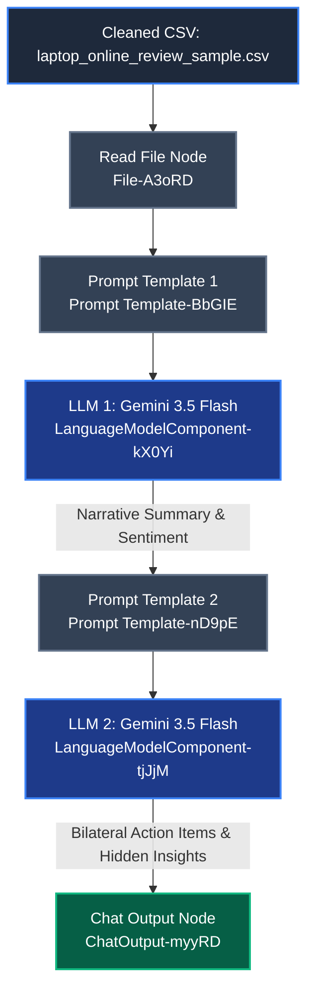

<div align="center">

<!-- Animated Header Banner -->


<br/>

<!-- Technology & Institutional Badges -->
[](https://www.python.org)
[](https://github.com/langflow-ai/langflow)
[](https://ai.google.dev/)
[](https://skillsbuild.org/)
[](https://www.hacktiv8.com/)

<br/>

<!-- Typing SVG for Key Highlights -->


</div>

---

## 📌 Project Overview

**Tech-Audit AI** is a specialized AI Agent pipeline designed to automate the process of analyzing e-commerce laptop customer reviews at scale. By leveraging **Langflow** for visual development and LLM orchestration combined with the **Gemini 3.5 Flash** model, Tech-Audit AI reads raw consumer sentiment and extracts narrative aspect summaries, bilateral action items, and hidden operational or technical insights.

This system serves as a powerful utility for product managers, customer experience teams, and operations departments to automatically sift through thousands of reviews, replacing manual auditing with structured, strategic business intelligence.

---

## 🏆 Key Features

*   **Bilateral Action Items:** Generates distinct, targeted business recommendations split between **Store Operational Teams** (e.g., shipping speed, packaging, customer service) and **Product Evaluation Teams/Vendors** (e.g., quality control, battery issues, hardware defects).
*   **Structured Aspect Extraction:** Evaluates customer feedback against four critical laptop dimensions: Machine Performance, Battery Endurance, Physical Hardware Quality, and Warranty/Customer Support.
*   **Hidden Insights Discovery:** Identifies low-frequency but critical issues (such as USB port issues or keyboard color contrasts) that can cause low-level return risks before they escalate into high-impact operational losses.
*   **No Bullet-Point Narrative Summaries:** Ensures high-density, cohesive textual summaries written in natural, continuous prose to retain analytical depth.
*   **Robust Data Quality Pipeline:** Prevents model hallucinations, sentiment bias, and API timeout failures through target-specific data cleaning and preprocessing.

---

## 📊 Dataset & Pre-processing

The analysis is driven by customer review records containing e-commerce feedback for various laptop models.

### Data Schema
| Column Name | Type | Description |
| :--- | :--- | :--- |
| `Unnamed: 0` | Integer | Unique identifier for each review (`message_id`) |
| `Product_name` | String | Full specification details and model name of the laptop |
| `Review` | String | Plain-text customer review containing feedback |
| `Rating` | Integer | Numerical customer satisfaction score (1 to 5) |

### 🔧 Data Profiling & Cleaning Process
A major challenge discovered during data profiling was that the raw dataset (`laptop_online_review.csv`) became contaminated with unrelated product data starting from **row 157 onwards**.
*   **Noise Identification:** The dataset contained reviews for smartphones (e.g., Apple, Samsung, Realme), Smart TVs, and refrigerators, which would severely distort sentiment mapping and keyword trends.
*   **Outlier Removal:** All contaminated rows (row 157+) were stripped from the active dataset.
*   **Data Sampling & Rate-Limit Optimization:** To prevent LLM API overload, context limits, and timeout exceptions on batch runs, the dataset was filtered down to a high-quality sample of **154 clean laptop review entries** (`laptop_online_review_sample.csv`). This process successfully maintained sentiment accuracy while maintaining low API latency.

---

## 🔬 Technical Architecture & Pipeline

Tech-Audit AI uses a sequential, multi-stage LLM chaining strategy. The output of the first model is dynamically injected as context for the second model, ensuring a clean segregation of concerns.



### Component Parameters
| Component Display Name | Component Type | Configured Model / Input | Core Role |
| :--- | :--- | :--- | :--- |
| **Read File** | `File` | `laptop_online_review_sample.csv` | Reads and feeds clean review records into Prompt Template 1 |
| **Prompt Template 1** | `Prompt Template` | Custom Prompt (`{text}`) | Directs the model to act as a Senior Data Analyst, focusing on 4 core metrics |
| **Language Model 1** | `LanguageModelComponent` | `gemini-3.5-flash` (Temp: 0.1) | Generates narrative summarizations and positive/neutral/negative sentiment |
| **Prompt Template 2** | `Prompt Template` | Custom Prompt (`{summary}`) | Focuses the summarized input to generate business action items and hidden insights |
| **Language Model 2** | `LanguageModelComponent` | `gemini-3.5-flash` (Temp: 0.1) | Outputs the final recommendation list and stakeholder-specific solutions |
| **Chat Output** | `ChatOutput` | Final message | Exposes the complete structured summary, action items, and sentiment |

---

## 🧠 Prompt Engineering Innovations

The prompts are engineered to force the Gemini model into a high-professionalism persona while ensuring the outputs fit strict structure constraints.

### 1. Extraction & Sentiment Persona (Prompt 1)
Designed to extract high-quality, non-bulleted prose summaries across 4 distinct dimensions:

<details>
<summary>🔍 <b>Click to View Prompt Template 1</b></summary>

```text
Anda adalah seorang Senior Data Analyst. Tugas Anda adalah menganalisis data ulasan produk dari dataset pelanggan pembeli laptop secara online. Sampaikan hasil analisis Anda dengan bahasa yang sangat jelas, sederhana, dan mudah dipahami oleh siapa saja, tanpa menghilangkan bobot profesionalitas.

Anda akan menerima data dengan kolom berikut:
* Unnamed: 0 → message_id
* Product_name → nama produk laptop
* Review → isi ulasan pelanggan
* Rating → rating numerik (1–5)

## Task 1: Ringkasan (Summarization)
Berdasarkan kolom “Review", buatlah ringkasan naratif dalam bentuk paragraf yang mengalir (TIDAK BOLEH MENGGUNAKAN BULLET POINT untuk bagian ringkasan ini). Bahasa harus formal namun disederhanakan agar mudah dicerna. 

Fokuskan ringkasan Anda secara tajam pada 4 aspek utama berikut:
1. Performa Mesin & Spesifikasi: Apakah laptop berjalan lancar atau sering lag?
2. Ketahanan Baterai & Umur Pakai: Bagaimana daya tahan baterai saat digunakan secara intensif?
3. Kualitas Hardware: Evaluasi pada layar (kejernihan, dead pixel), audio (kualitas suara), dan fisik/material body laptop.
4. Garansi & Respons CS: Bagaimana pengalaman pelanggan saat mengklaim garansi atau bertanya kepada Customer Service?

## Task 2: Analisis Sentimen
Tentukan sentimen keseluruhan berdasarkan tone umum pelanggan.
* Positive: Mayoritas ulasan berisi kepuasan, pujian pada performa/hardware.
* Neutral: Ulasan seimbang, informatif, atau sekadar memberikan bintang tanpa keluhan berarti.
* Negative: Ulasan didominasi kekecewaan pada cacat produk, baterai bocor, atau klaim garansi yang dipersulit.

Input Data Review:
{text}

Format Output Wajib:
* summary: Ringkasan naratif dalam paragraf berkelanjutan (sekali lagi, tanpa bullet point).
* sentiment: (Pilih salah satu: Positive / Neutral / Negative).
```
</details>

### 2. Strategic Advisory Persona (Prompt 2)
Focuses the summary output into concrete, actionable operations and product engineering steps:

<details>
<summary>💡 <b>Click to View Prompt Template 2</b></summary>

```text
Anda adalah Senior Data Analyst yang sedang memberikan presentasi kepada manajemen. Berdasarkan ringkasan analisis ulasan laptop berikut, buatlah rekomendasi taktis (Action Items) yang terstruktur, tajam, dan menggunakan bahasa yang mudah dipahami. 

Rekomendasi ini harus menyasar dua pihak sekaligus secara berimbang, serta mencoba mengungkap celah masalah yang mungkin tersembunyi dari ulasan.

### Panduan untuk Action Item:
1. Untuk Tim Operasional Toko: Berikan langkah konkret terkait perbaikan keamanan pengemasan (packing), kecepatan pengiriman, dan kemudahan layanan klaim garansi atau respons Customer Service.
2. Untuk Tim Evaluasi Produk/Vendor: Berikan langkah perbaikan terkait kontrol kualitas (QC) pabrik, seperti isu cacat hardware (layar, audio), ketahanan baterai, dan kesesuaian spesifikasi.
3. Hidden Insights (Celah Tersembunyi): Temukan setidaknya satu pola masalah tidak terduga atau celah dari ringkasan yang berpotensi merugikan bisnis jika dibiarkan (misalnya: rating tinggi tapi ada keluhan kecil berulang pada port USB).

### Ringkasan Input:
{summary}

Buat action item yang sangat spesifik, langsung pada intinya (to the point), dan mudah dieksekusi oleh kedua tim tersebut.

## Return Wajib:
* {summary}
* [action_item]
* [sentiment]
```
</details>

---

## ⚙️ How to Run

Follow these steps to import and run this workflow on your system:

### Prerequisites
Make sure you have Python 3.10+ installed.

### 1. Install Langflow
Install Langflow via pip:
```bash
pip install langflow
```

### 2. Launch Langflow
Run the following command to launch the Langflow dashboard locally:
```bash
langflow run
```
After the dashboard opens, access it in your browser (usually at `http://127.0.0.1:7860`).

### 3. Import the JSON Flow
1. In the Langflow dashboard, click on **New Project**.
2. Select **Upload Flow / Import JSON**.
3. Choose the file `Sentiment Analysis Laptop Online Review - Hasan.json` from the repository root.

### 4. Configure the Google Gemini API Key
1. Locate the two **Language Model** components in the workspace graph.
2. In the `api_key` field, input your **Google Gemini API Key** (or ensure that the `GOOGLE_API_KEY` environment variable is exported in your terminal session before launching Langflow).

### 5. Upload the Cleaned Dataset
1. In the **Read File** node (`File-A3oRD`), click the file upload area.
2. Upload `laptop_online_review_sample.csv` from this repository.

### 6. Execute the Analysis Flow
1. Click the **Play** button on the bottom right or directly trigger the flow.
2. Open the **Chat Output** node (`ChatOutput-myyRD`) to inspect the final generated narrative summary, targeted business action items, and overall sentiment analysis.

---

## 👥 Author & Context

*   **Author:** Hasan Shofiyyur Rahman
*   **Project Context:** Capstone Project for the short course **"Build an AI Agent"** program by **IBM SkillsBuild University Education** in collaboration with **Hacktiv8**.
*   **Advisor/Institution:** Hacktiv8 Indonesia & IBM SkillsBuild.

---

## 📄 License

This project is licensed under the [MIT License](LICENSE) - see the LICENSE file for details.

---

<div align="center">


<br/>

**Designed & Implemented by Hasan Shofiyyur Rahman — Tech-Audit AI 2026**

</div>
